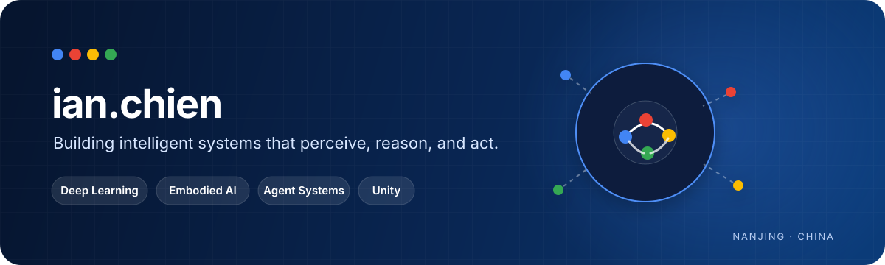

 

## Hello, I'm Ian

I'm a student at **Nanjing University of Posts and Telecommunications**, building at the intersection of deep learning, embodied intelligence, agent systems, and interactive simulation.

I care about the full loop: turning raw sensor signals into perception, turning intent into plans, and turning plans into safe actions in simulated and physical worlds.

<table>
  <tr>
    <td width="25%" valign="top">
      <h3>◉ Deep Learning</h3>
      
Vision, signal processing, multimodal perception, and model deployment.

    </td>
    <td width="25%" valign="top">
      <h3>◇ Embodied AI</h3>
      
Perception–action loops, robot manipulation, and sim-to-real systems.

    </td>
    <td width="25%" valign="top">
      <h3>✦ Agents</h3>
      
Planning, tools, memory, workflows, and safety-gated execution.

    </td>
    <td width="25%" valign="top">
      <h3>△ Unity</h3>
      
Interactive simulation, virtual laboratories, and scientific visualization.

    </td>
  </tr>
</table>

## Selected work

<table>
  <tr>
    <td width="50%" valign="top">
      <h3><a href="https://github.com/Yiannnn-202/SensorAgent">SensorAgent ↗</a></h3>
      
<strong>An agent runtime for embodied tasks.</strong>

      
Connects task understanding, skill and tool orchestration, multimodal input, robot simulation, and safety-gated hardware adapters.

      
<code>Python</code> <code>ROS 2</code> <code>Gazebo</code> <code>MoveIt 2</code> <code>MCP</code>

    </td>
    <td width="50%" valign="top">
      <h3><a href="https://github.com/Yiannnn-202/Sensotelligence">Sensotelligence ↗</a></h3>
      
<strong>From radar signals to health intelligence.</strong>

      
A contactless vital-sign monitoring platform spanning mmWave sensing, signal processing, deep-learning inference, and real-time analysis.

      
<code>PyTorch</code> <code>FastAPI</code> <code>WebSocket</code> <code>React</code>

    </td>
  </tr>
  <tr>
    <td width="50%" valign="top">
      <h3><a href="https://github.com/Yiannnn-202/ElectroOptic-Lab-Unity">ElectroOptic Lab ↗</a></h3>
      
<strong>A virtual electro-optics laboratory in Unity.</strong>

      
Combines crystal optics, polarization, GPU visualization, interactive experiments, data analysis, and report generation.

      
<code>Unity</code> <code>C#</code> <code>HLSL</code> <code>Scientific Computing</code>

    </td>
    <td width="50%" valign="top">
      <h3><a href="https://github.com/Island-Team">Island Team ↗</a></h3>
      
<strong>Building embodied intelligence from cognition to action.</strong>

      
Exploring modular robot cognition, perception and models, typed system boundaries, simulation, and controlled physical execution.

      
<code>Embodied AI</code> <code>Agent</code> <code>Robotics</code> <code>Sim-to-Real</code>

    </td>
  </tr>
</table>

## Toolbox

---

### Let's build intelligence that can meet the real world.

Open to conversations about embodied agents, multimodal perception, robotics, and simulation.

  

[Email](mailto:yiannnn202@gmail.com) · [Projects](https://github.com/Yiannnn-202?tab=repositories) · [Island Team](https://github.com/Island-Team)

